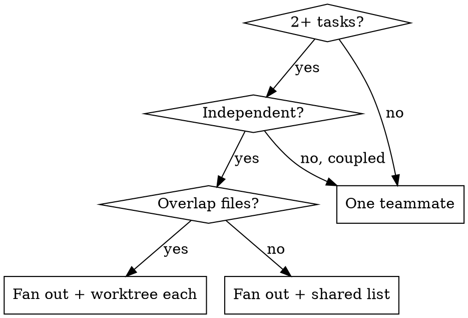

# Dispatching Parallel Teams

Run independent work concurrently: spawn named teammates with isolated context you construct, let them claim tasks from a shared list, require progress messages + a peer channel, then synthesize.

## When

Good fits: test files failing on different root causes, independent subsystems, parallel research threads, competing spikes. Not for: coupled failures (fixing one may fix others), exploratory debugging before you know what broke, or anything needing one whole-system view. Deterministic fan-out (loops, judge panels, schema-validated outputs, resumable runs) with user opt-in: prefer the Workflow tool; routing table in dmj:harnessing-claude.

## The mechanism

The session has ONE implicit team; there is no team to create. A teammate is an `Agent` you spawn with a `name`, and that name is the address you use for the rest of the session.

| Need | Call |
|---|---|
| Spawn teammates concurrently | Several `Agent` calls **in a single message**. Separate messages run them serially. |
| Make one addressable | `Agent(name: "...")`, required if you intend to message it |
| Talk to one | `SendMessage({to: "<name>"})` |
| Continue one that already finished | `SendMessage` to the same name: it resumes from its transcript, context intact |
| Parallel edits to overlapping files | `isolation: "worktree"` on the spawn (dmj:using-git-worktrees) |
| Model on any spawn | `model: "opus[1m]"` for judgement work (definition, adversarial review, security, synthesis); `model: "sonnet[1m]"` for mechanical or criteria-bounded work. Long-context aliases where the harness accepts them, the session's configured spawn-model setting otherwise; never below Sonnet, never a pinned version. The lead orchestrates on whatever model the session runs |
| Wait for a result before continuing | `run_in_background: false`, ONLY when that single result gates the immediate next step. Everything else stays in the background and notifies on completion |

## Fan out

1. **Split into domains.** One task per independent problem; name the file set each touches so overlaps surface now.
2. **One `Agent` per domain, all in a single message**, each with a unique `name`, background, model per the tier row above, max thinking. Overlapping file sets get `isolation: "worktree"` or serialize.
3. **Shared task list.** Post all tasks; each teammate CLAIMS one, marks it in-progress, moves to the next free one when done. Claiming prevents two teammates colliding on the same task.

## Each teammate prompt carries

- **Focused scope:** one domain, not "fix everything".
- **Self-contained context:** the errors, file paths, constraints needed, no reliance on your session history.
- **Constraints:** what NOT to touch (e.g. "tests only, no production code").
- **Required output:** root cause + exact changes, so you can synthesize.

## Coordination (never fire-and-forget)

A teammate's plain text is invisible to every other agent: `SendMessage` is the only channel. Teammates MUST send a midway progress update and MAY message peers about anything shared (an interface, a fixture, a root cause). Fire-and-forget is forbidden: you lose visibility, teammates duplicate or conflict. Incoming messages arrive automatically; the lead stays available to unblock.

**Orchestrator posture.** The lead session is the control plane, not a log sink: delegate processing and bulk reading, hold conclusions not transcripts, stay responsive to the user. Teammate traffic stays out of the main thread: midway updates are one-line messages, raw transcripts and file dumps never enter the lead context, and the user sees your synthesis, never agent output. A user update mid-run is a STEER: relay it to the affected running teammates via `SendMessage` (they receive it on their next turn); never stop or respawn agents for a course correction.

## Synthesize

When teammates report: read each result, check for conflicting edits, run the full suite to confirm fixes compose, spot-check (parallel workers repeat the same systematic error). Resolve conflicts before integrating.

**A teammate's final report is never shown to the user**: relay what matters in your own words. Never state or predict a still-running teammate's findings; wait for the completion notification.

## Headless mode

No interactive user: dispatch on the plan as written, record assumptions, PARK only user-owned decisions (irreversible, security, cost, public surface). One teammate's blocker halts its task, not the others.

## Red flags (stop)

- Spawning teammates with no progress messages or peer channel (fire-and-forget).
- Spawn calls split across separate messages when the work is independent (that is serial, not parallel).
- Two teammates on overlapping files with no worktree.
- A scope so broad ("fix all tests") the teammate gets lost.
- Integrating without a full-suite run and conflict check.
- Reporting a pending teammate's result before its completion notification arrived.
- Fanning out coupled work that one investigation would solve faster.
- A spawn below the Sonnet tier, a pinned model version, or a foreground wait whose result does not gate the immediate next step.

Handoff: this primitive powers **dmj:brainstorming** (context sweep, review lenses), **dmj:executing-plans**, and **dmj:team-driven-development** (per-wave fan-out).
