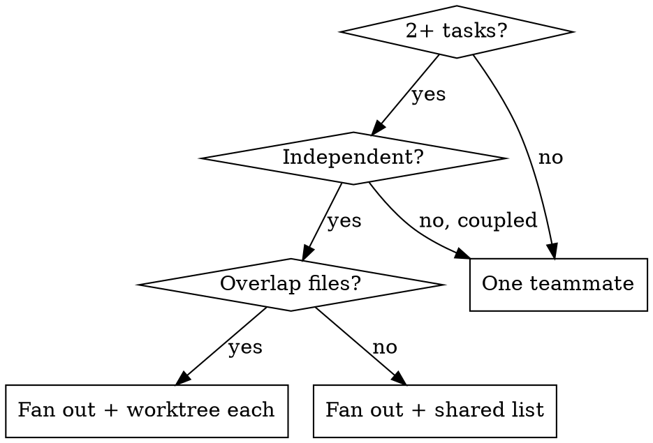

# Dispatching Parallel Teams

Run independent work concurrently with an Agent Team: spawn teammates with isolated context you construct, let them claim tasks from a shared list, require progress messages and a peer channel, then synthesize. This is the fan-out primitive the workflow skills build on.

## When

Good fits: test files failing on different root causes, independent subsystems, parallel research threads, competing spikes. Not for: coupled failures (fixing one may fix others), exploratory debugging before you know what broke, or anything needing one whole-system view.

## Fan out

1. **Split into domains.** One task per independent problem; name the file set each touches so overlaps surface now.
2. `TeamCreate`, then one `Agent` per domain (always `team_name` and a unique `name`, strongest model available at invocation, max thinking). Overlapping file sets get a worktree each (dmjcustomizations:using-git-worktrees) or serialize. If TeamCreate is unavailable, run the same domains as native parallel `Agent` calls and synthesize yourself.
3. **Shared task list.** Post all tasks; each teammate CLAIMS one, marks it in-progress, and moves to the next free one when done. Claiming prevents two teammates colliding on the same task.

## Each teammate prompt carries

- **Focused scope:** one domain, not "fix everything".
- **Self-contained context:** the errors, file paths, and constraints needed, no reliance on your session history.
- **Constraints:** what NOT to touch (e.g. "tests only, no production code").
- **Required output:** root cause + exact changes, so you can synthesize.

## Coordination (never fire-and-forget)

Teammates MUST `SendMessage` a midway progress update and MAY message peers about anything shared (an interface, a fixture, a discovered root cause). Fire-and-forget (spawn and walk away) is forbidden: you lose visibility and teammates duplicate or conflict. You (lead) stay available to unblock.

## Synthesize

When teammates report: read each result, check for conflicting edits (same file touched by two), run the full suite to confirm fixes compose, and spot-check (parallel workers can make the same systematic error). Resolve conflicts before integrating.

## Headless mode

No interactive user: dispatch on the plan as written, record assumptions, and PARK only user-owned decisions (irreversible, security, cost, public surface). One teammate's blocker halts its task, not the others.

## Red flags (stop)

- Spawning teammates with no progress messages or peer channel (fire-and-forget).
- Two teammates on overlapping files with no worktree.
- A scope so broad ("fix all tests") the teammate gets lost.
- Integrating without a full-suite run and conflict check.
- Fanning out coupled work that one investigation would solve faster.

Handoff: this primitive powers **dmjcustomizations:brainstorming** (context sweep, review lenses), **dmjcustomizations:executing-plans**, and **dmjcustomizations:team-driven-development** (per-wave fan-out).
