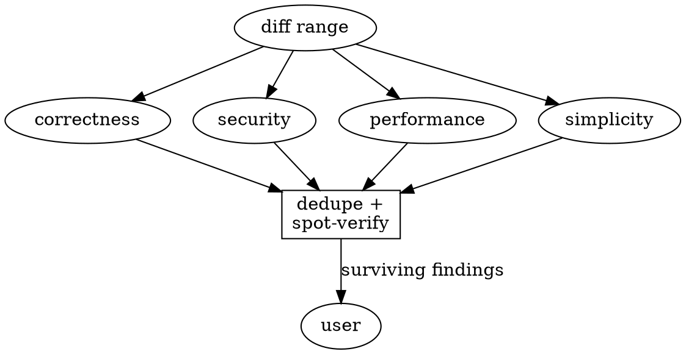

# Requesting Code Review

Review early, review often, never review your own diff in your own context: you already believe it is correct. Dispatch fresh-context teammates who see only the work product, never your reasoning.

## When

**Mandatory:** after each task in team-driven development, after a major feature, before merge to main. **Valuable:** when stuck, before a large refactor.

## Run a parallel review panel, not one reviewer

A single reviewer misses by lens. Spin a team (`dmj:dispatching-parallel-teams`), dispatch four fresh-context teammates concurrently, each with the same diff and one lens. They work in parallel and post progress midway.

| Lens | Hunts for | Anchored by |
|------|-----------|-------------|
| Correctness | logic bugs, broken edge cases, plan deviations, missing functionality | the plan / requirements |
| Security | injection, authz gaps, unsafe input handling, secret leakage, blast radius | `dmj:defending-in-depth` |
| Performance | complexity regressions, N+1, missing caching, budget breaches | `dmj:enforcing-performance-budgets` |
| Simplicity | dead code, premature abstraction, duplication, YAGNI, naming | matching surrounding code |

User-facing diff: add a fifth **Experience** lens (template-generic look, added user burden, dead ends, animation without purpose, needs-docs-to-use), anchored by `dmj:crafting-experiences`.

TeamCreate unavailable? Run the four lenses as native parallel Agent calls and synthesize the reports yourself. Give every teammate the diff range, not your history:

```bash
BASE_SHA=$(git rev-parse origin/main)   # or HEAD~1, or the task's start SHA
HEAD_SHA=$(git rev-parse HEAD)
```

Each returns findings as `file:line + what + why + severity (Critical/Important/Minor)`. Prompt skeleton: `review-lens.md`.

## Consolidate, dedupe, spot-verify



Lenses overlap, so collapse duplicate findings to one. Then adversarially spot-verify before anything reaches the user: a lens can hallucinate a bug. For each Critical/Important finding, confirm it against the actual code (the cited line really does what the finding says). Drop or downgrade findings that do not survive. Unverified speculation never reaches the user as fact.

## Act on surviving findings

Fix Critical immediately, Important before proceeding, note Minor. A finding you believe is wrong: neither silently comply nor silently ignore, push back with technical reasoning (`dmj:receiving-code-review`).

## Blast radius

Default panel is four teammates. For a tiny, low-risk diff you may state the tier to the user and run a narrower panel (e.g. correctness + security only). Name the tier when you narrow it; never narrow silently.

## Red flags

Skipping review because "it is simple," reviewing your own diff in your own context, a diff covering more than one concern, passing a finding to the user without spot-verifying it, ignoring a Critical, proceeding with unfixed Important.

## Headless mode

A background agent runs the full panel unprompted, consolidates and spot-verifies, then puts surviving findings with their fixes (and any pushback with reasoning) in the final report. Park nothing it can verify itself; flag only genuine judgment calls the user owns.

Findings resolved? Next: `dmj:finishing-a-development-branch`. Receiving the feedback: `dmj:receiving-code-review`.
